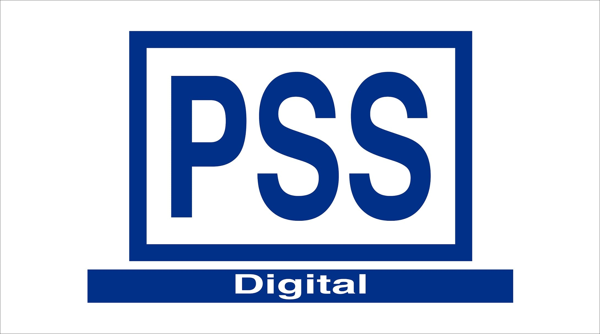

<a name="readme-top"></a>

<!-- TABLE OF CONTENTS -->

# 📗 Table of Contents

- [📖 About the Project](#about-project)
  - [🛠 Built With](#built-with)
    - [Tech Stack](#tech-stack)
    - [Key Features](#key-features)
  - [Preview](#preview)
  - [🚀 Live Demo](#live-demo)
- [💻 Getting Started](#getting-started)
  - [Setup](#setup)
  - [Prerequisites](#prerequisites)
  - [Install](#install)
  - [Usage](#usage)
  - [Run tests](#run-tests)
  <!-- - [Deployment](#triangular_flag_on_post-deployment) -->
- [👥 Authors](#authors)
- [🔭 Future Features](#future-features)
- [🤝 Contributing](#contributing)
- [⭐️ Show your support](#support)
- [🙏 Acknowledgements](#acknowledgements)
- [❓ FAQ (OPTIONAL)](#faq)
- [📝 License](#license)

<!-- PROJECT DESCRIPTION -->

# 📖 PSS-DIGITAL <a name="about-project"></a>

**PSS-Digital** is a proven digital solution that makes online shopping easy, convenient, and enjoyable for customers. The application also helps other businesses maximize their customer base through e-commerce. With PSS Digital, we help you achieve success while also supporting you in efficient business management.

## 🛠 Built With <a name="built-with"></a>

### Tech Stack <a name="tech-stack"></a>

  <summary>Client</summary>
  <ul>
    <li><a href="https://reactjs.org/">React.js</a></li>
  </ul>

  <summary>Server</summary>
  <ul>
    <li><a href="https://api.rubyonrails.org/">Ruby on Rails</a></li>
  </ul>

  <summary>Database</summary>
  <ul>
    <li><a href="https://www.postgresql.org/">PostgreSQL</a></li>
  </ul>

### Key Features <a name="key-features"></a>

- **[Fetch all orders from API endpoint]**
- **[Fetch all products from API endpoint]**
- **[Authenticate users]**
- **[Add product]**
- **[Delete product]**
- **[Place orders]**

## Preview <a name="preview"></a>



## 🚀 Live Demo <a name="live-demo"></a>

- [Live Demo Link](https://pss-digital.netlify.app/)

### Backend <a name="backend"></a>

- [Backend repository](https://github.com/Olivier-Kango/pss-digital-backend)

### 💻 Getting Started <a name="getting-started"></a>

To get a local copy up and running, follow these steps.

### Prerequisites

In order to run this project you need:

> - [Install Git](https://git-scm.com/).
> - Install a code editor of your choice.
> - Knowledge of javascript,react and Ruby on Rails.
> - Github account is required.
> - [Install nodejs](https://nodejs.org/ca/blog/release/v16.19.0).

### Setup

Clone this repository to your desired folder:

```sh
  git clone https://github.com/Olivier-Kango/pss-digital-frontend.git
```

### Install

Install this project with:

```sh
  cd pss-digital-frontend # Change directory into project folder
  npm install # Installs project dependencies
```

### Usage

To run the project, execute the following command:

```sh
  npm start # for running the project in development mode

  npx stylelint "**/*.{css,scss}" --fix # Stylelint errors auto correct
  npx eslint "**/*.{js,jsx}" --fix # Eslint errors auto correct
```

### Run tests

To run tests, run the following command:

```sh
  npm test  # for running the tests
```

<!-- AUTHORS -->
<p align="right">(<a href="#readme-top">back to top</a>)</p>

## 👥 Authors <a name="authors"></a>

👤 **Dave Zagabe** 

[](https://github.com/daveZag/)
[](https://www.linkedin.com/in/davezagabe/)
[](https://twitter.com/davezagabe2/)

👤 **Kasaija Kenneth** 

[](https://github.com/Kasaija-Kenneth/)
[](https://www.linkedin.com/in/kasaija-kenneth/)
[](https://twitter.com/kenn_ug/)

👤 **Kaweesi Matia** 

[](https://github.com/Kaweesi-Matia/)
[](https://www.linkedin.com/in/kaweesi-matia/)
[](https://twitter.com/kaweesimatia/)

👤 **Olivier Kango** 

[](https://github.com/Olivier-Kango/)
[](https://www.linkedin.com/in/olivier-kango-b990601b8/)
[](https://twitter.com/olivierkango1/)

👤 **Elijah Odjegba** 

[](https://github.com/Elijahdre/)
[](https://www.linkedin.com/in/elijah-odjegba/)
[](https://twitter.com/kingglijah/)

<!-- FUTURE FEATURES -->

## 🔭 Future Features <a name="future-features"></a>

- [ ] **[Improvements on UI design]**
- [ ] **[Mobile version]**
- [ ] **[new_feature_3]**

<!-- CONTRIBUTING -->

## 🤝 Contributing <a name="contributing"></a>

Contributions, issues, and feature requests are welcome!

Feel free to check the [issues page](../../issues/).

<!-- SUPPORT -->

## ⭐️ Show your support <a name="support"></a>

> Write a message to encourage readers to support your project

If you like this project...

<p align="right">(<a href="#readme-top">back to top</a>)</p>

<!-- ACKNOWLEDGEMENTS -->

## 🙏 Acknowledgments <a name="acknowledgements"></a>

I would like to acknowledge:

- [Microverse](https://www.microverse.org/) for the opportunity to work on this project
- [The creative common](https://www.behance.net/gallery/19759151/Snapscan-iOs-design-and-branding?tracking_source=) for the design
- Design from [Murat Korkmaz on Behance](https://www.behance.net/gallery/26425031/Vespa-Responsive-Redesign)

## ❓ FAQ <a name="faq"></a>

- **How I can run this project?**

  - After cloning repository, run `npm install` to install all dependencies. Then run `npm start` to run the project.

- **How I can run tests?**

  - After cloning repository, run `npm install` to install all dependencies. Then run `npm test` to run the tests.

<!-- LICENSE -->

## 📝 License <a name="license"></a>

This project is [MIT](./LICENSE) licensed.

<p align="right">(<a href="#readme-top">back to top</a>)</p>

